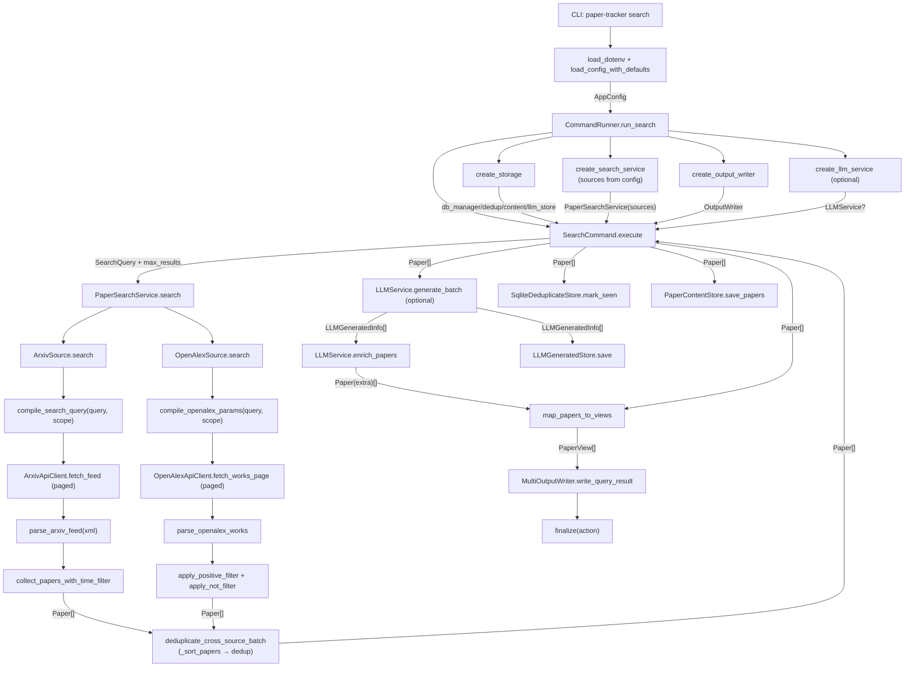

# Paper Tracker Code Flow Overview

> The following content was translated using a large language model (LLM)

## 1. Overview

Paper Tracker currently uses the `search` command as the primary execution path: the CLI loads configuration and builds multiple sources (arXiv / OpenAlex) from the configured source list; the service layer dispatches unified query semantics to each source adapter in parallel; after each source finishes fetching, results are aggregated in the service layer; cross-source deduplication then produces the main `Paper[]` list. The flow then enters optional LLM enrichment, maps to `PaperView`, outputs through multi-format writers, and finally stores conditionally for deduplication and content persistence. The overall design follows a layered structure: "configuration-driven + unified domain model + adapter-based external API isolation + cross-source deduplication".

## 2. Module Breakdown

### 2.1 CLI and Orchestration

- Directory: `src/PaperTracker/__main__.py`, `src/PaperTracker/cli`
- Responsibilities: command entry, config loading, dependency orchestration, execution, and cleanup
- Key objects: `CommandRunner`, `SearchCommand`

### 2.2 Configuration System

- Directory: `src/PaperTracker/config`
- Responsibilities: YAML parsing, default merge, domain validation
- Key objects: `AppConfig`, `SearchConfig`

### 2.3 Domain Model and Query DSL

- Directory: `src/PaperTracker/core`
- Responsibilities: define unified paper entities and query semantics
- Key objects: `Paper`, `LLMGeneratedInfo`, `SearchQuery`, `FieldQuery`

### 2.4 Search Service Layer

- Directory: `src/PaperTracker/services`
- Responsibilities: use-case level multi-source search interface, bridge CLI and each source; aggregate after parallel source search, then perform cross-source ranking and deduplication
- Key objects: `PaperSource` (protocol), `PaperSearchService`, `deduplicate_cross_source_batch`

### 2.5 Source Registry

- Directory: `src/PaperTracker/sources/registry.py`
- Responsibilities: build source instances one by one from config `search.sources`, isolate source construction details
- Key objects: `build_source`, `SourceBuilder`

### 2.6 arXiv Adapter

- Directory: `src/PaperTracker/sources/arxiv`
- Responsibilities: query compilation, HTTP fetching, XML parsing, multi-page pagination, and time-window strategy
- Key objects: `ArxivSource`, `collect_papers_with_time_filter`

### 2.7 OpenAlex Adapter

- Directory: `src/PaperTracker/sources/openalex`
- Responsibilities: compile queries into OpenAlex REST params, paged JSON fetching, inverted-index abstract reconstruction, local positive/exclusion filtering, time-window strategy
- Key objects: `OpenAlexSource`, `collect_papers_with_time_filter_openalex`, `compile_openalex_params`, `parse_openalex_works`

### 2.8 LLM Enrichment

- Directory: `src/PaperTracker/llm`
- Responsibilities: batch translation/summary generation and backfill paper extension fields
- Key objects: `LLMService`, `LLMProvider`

### 2.9 Render Output

- Directory: `src/PaperTracker/renderers`
- Responsibilities: domain-object mapping and multi-format output aggregation
- Key objects: `PaperView`, `MultiOutputWriter`

### 2.10 Storage Layer

- Directory: `src/PaperTracker/storage`
- Responsibilities: SQLite connection management, deduplication, paper content storage, and LLM result storage
- Key objects: `DatabaseManager`, `SqliteDeduplicateStore`, `PaperContentStore`, `LLMGeneratedStore`

## 3. Call and Data Flow Diagram

## 4. Core Data Structures

- `AppConfig`: global root config object used throughout component construction.
- `SearchQuery` / `FieldQuery`: unified query DSL, preventing CLI from being directly bound to arbitrary source syntax.
- `Paper`: standard paper entity across the system, shared by source, service, llm, renderer, and storage; `extra.work_type` is used for cross-source deduplication priority.
- `LLMGeneratedInfo`: container for LLM-generated results, later backfilled into `Paper.extra`.
- `PaperView`: presentation-layer model, isolating output format from domain model.

## 5. Main Call Chains (Function Level)

### 5.1 CLI Main Chain

- `main()` -> `cli()` -> `search_cmd(...)`
- `search_cmd(...)` -> `load_config_with_defaults(...)` -> `CommandRunner.run_search(...)`
- `run_search(...)` -> create `storage/search_service/output_writer/llm_service` -> `SearchCommand.execute()` -> `output_writer.finalize(...)`

### 5.2 Configuration Main Chain

- `load_config_with_defaults(...)` -> `merge_config_dicts(...)` -> `parse_config_dict(...)`
- `parse_config_dict(...)` -> `load_runtime/load_search/load_output/load_storage/load_llm`
- `parse_config_dict(...)` -> `check_runtime/check_search/check_output/check_storage/check_llm` -> `AppConfig`

### 5.3 Search Main Chain (Multi-source)

- `SearchCommand.execute()` -> `PaperSearchService.search(...)`
- `PaperSearchService.search(...)` -> iterate `sources`, call `source.search(query, max_results=max_results)` for each source
- After each source returns `Paper[]`, aggregate -> `_sort_papers(aggregated)` -> `_deduplicate_in_batch(ranked)` -> `[:max_results]`
- `_deduplicate_in_batch(...)` -> `deduplicate_cross_source_batch(...)`: deduplicate by DOI and title-author-year fingerprint, prefer published article

### 5.4 arXiv Data Main Chain

- `collect_papers_with_time_filter(...)` -> `compile_search_query(...)`
- `collect_papers_with_time_filter(...)` -> `_fetch_page(...)` (pagination loop)
- `_fetch_page(...)` -> `ArxivApiClient.fetch_feed(...)` -> `parse_arxiv_feed(...)` -> `Paper[]`

### 5.5 OpenAlex Data Main Chain

- `OpenAlexSource.search(...)` -> `collect_papers_with_time_filter_openalex(...)`
- `collect_papers_with_time_filter_openalex(...)` -> `compile_openalex_params(...)` + `_attach_publication_date_filter(...)` -> pagination loop
- Per page: `_fetch_page(...)` -> `OpenAlexApiClient.fetch_works_page(...)` -> JSON `results[]`
- `parse_openalex_works(results)` -> `apply_positive_filter(...)` -> `apply_not_filter(...)` -> `_apply_time_window(...)`
- Optional: `dedup_store.filter_new_in_source("openalex", page_papers)`
- Final: `sorted(collected, key=_resolve_sort_timestamp, reverse=True)[:max_results]`

### 5.6 LLM Main Chain (Optional)

- `create_llm_service(...)` -> build `LLMService`
- `SearchCommand.execute()` -> `LLMService.generate_batch(...)`
- `LLMService.generate_batch(...)` -> `provider.translate_abstract(...)` / `provider.generate_summary(...)`
- `LLMService.enrich_papers(...)` -> enriched `Paper[]`

### 5.7 Output Main Chain

- `map_papers_to_views(...)` -> `PaperView[]`
- `create_output_writer(...)` -> `MultiOutputWriter(...)`
- `write_query_result(...)` -> dispatch to `ConsoleOutputWriter/JsonFileWriter/MarkdownFileWriter/HtmlFileWriter`
- `finalize(...)` -> output to terminal or files

### 5.8 Storage Main Chain (Optional)

- `create_storage(...)` -> `DatabaseManager` + `SqliteDeduplicateStore` + `PaperContentStore`
- `SearchCommand.execute()` -> `dedup_store.mark_seen(...)`
- `SearchCommand.execute()` -> `content_store.save_papers(...)`
- `SearchCommand.execute()` -> `llm_store.save(...)`

## 6. Risks and Improvement Points

- Standardization of `Paper.extra` extension fields: recommend adding a field contract document (at least constrain key structure for `translation` / `summary` / `work_type`).
- arXiv fetch observability: add metrics for "filter reason counts per round" to help tune `pull_every/max_fetch_items/fill_enabled`.
- OpenAlex local filtering cost: `apply_positive_filter` performs full scans after each page; with large `fetch_batch_size` and complex boolean conditions, consider precompiled regex or Aho-Corasick acceleration.
- Cross-source deduplication confidence: when DOI and title-author-year fingerprints are both missing, it degrades to source+id uniqueness, so the same paper from two sources may not merge; fuzzy-title fingerprints can be added later.
