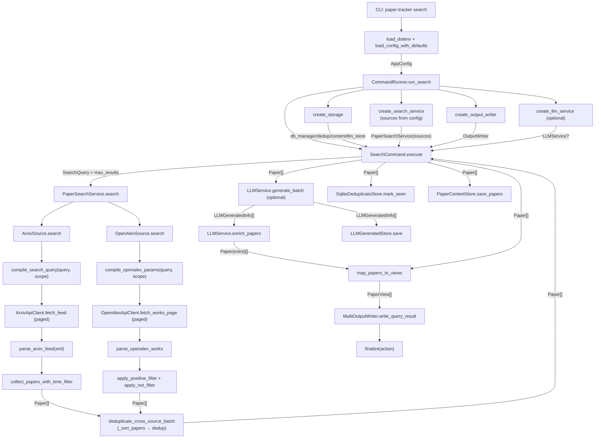

# Paper Tracker 项目代码流程总览

## 1. 总览

Paper Tracker 当前以 `search` 命令为主链路：CLI 读取配置并按配置列表构建多个数据源（arXiv / OpenAlex），服务层将统一查询语义并行下发到各 source 适配器，各自完成抓取后在服务层聚合，经跨源去重得到 `Paper[]` 主列表；再进入可选 LLM 增强，映射为 `PaperView` 输出到多格式 writer，最后按条件落库用于去重与内容沉淀。整体设计采用"配置驱动 + 领域模型统一 + 适配器隔离外部 API + 跨源去重"的分层结构。

## 2. 模块拆分

### 2.1 CLI 与调度

- 目录：`src/PaperTracker/__main__.py`, `src/PaperTracker/cli`
- 主要职责：命令入口、配置加载、依赖编排、执行与清理
- 关键对象：`CommandRunner`, `SearchCommand`

### 2.2 配置系统

- 目录：`src/PaperTracker/config`
- 主要职责：YAML 解析、默认值合并、域内校验
- 关键对象：`AppConfig`, `SearchConfig`

### 2.3 领域模型与查询 DSL

- 目录：`src/PaperTracker/core`
- 主要职责：定义统一论文实体与查询语义
- 关键对象：`Paper`, `LLMGeneratedInfo`, `SearchQuery`, `FieldQuery`

### 2.4 搜索服务层

- 目录：`src/PaperTracker/services`
- 主要职责：用例级多源搜索接口，桥接 CLI 与各 source；各源并行搜索后聚合，执行跨源排序与去重
- 关键对象：`PaperSource`（协议）, `PaperSearchService`, `deduplicate_cross_source_batch`

### 2.5 Source 注册表

- 目录：`src/PaperTracker/sources/registry.py`
- 主要职责：按配置 `search.sources` 列表逐一构建 source 实例，隔离 source 创建细节
- 关键对象：`build_source`, `SourceBuilder`

### 2.6 arXiv 适配器

- 目录：`src/PaperTracker/sources/arxiv`
- 主要职责：查询编译、HTTP 拉取、XML 解析、多轮分页与时间窗口策略
- 关键对象：`ArxivSource`, `collect_papers_with_time_filter`

### 2.7 OpenAlex 适配器

- 目录：`src/PaperTracker/sources/openalex`
- 主要职责：查询编译为 OpenAlex REST 参数、分页 JSON 拉取、倒排索引摘要重建、本地正向/排除过滤、时间窗口策略
- 关键对象：`OpenAlexSource`, `collect_papers_with_time_filter_openalex`, `compile_openalex_params`, `parse_openalex_works`

### 2.8 LLM 增强

- 目录：`src/PaperTracker/llm`
- 主要职责：批量翻译/摘要生成并回填论文扩展字段
- 关键对象：`LLMService`, `LLMProvider`

### 2.9 渲染输出

- 目录：`src/PaperTracker/renderers`
- 主要职责：领域对象映射与多格式输出汇总
- 关键对象：`PaperView`, `MultiOutputWriter`

### 2.10 存储层

- 目录：`src/PaperTracker/storage`
- 主要职责：SQLite 连接管理、去重、论文内容与 LLM 结果存储
- 关键对象：`DatabaseManager`, `SqliteDeduplicateStore`, `PaperContentStore`, `LLMGeneratedStore`

## 3. 调用与数据流图

## 4. 核心数据结构

- `AppConfig`：全局配置根对象，贯穿组件构建阶段。
- `SearchQuery` / `FieldQuery`：统一查询 DSL，避免 CLI 直接绑定任意 source 语法。
- `Paper`：系统标准论文实体，source、service、llm、renderer、storage 共用；`extra.work_type` 用于跨源去重优先级判断。
- `LLMGeneratedInfo`：LLM 生成结果载体，后续回填到 `Paper.extra`。
- `PaperView`：展示层模型，隔离输出格式与领域模型。

## 5. 主要调用链（函数级）

### 5.1 CLI 主链

- `main()` -> `cli()` -> `search_cmd(...)`
- `search_cmd(...)` -> `load_config_with_defaults(...)` -> `CommandRunner.run_search(...)`
- `run_search(...)` -> 创建 `storage/search_service/output_writer/llm_service` -> `SearchCommand.execute()` -> `output_writer.finalize(...)`

### 5.2 配置主链

- `load_config_with_defaults(...)` -> `merge_config_dicts(...)` -> `parse_config_dict(...)`
- `parse_config_dict(...)` -> `load_runtime/load_search/load_output/load_storage/load_llm`
- `parse_config_dict(...)` -> `check_runtime/check_search/check_output/check_storage/check_llm` -> `AppConfig`

### 5.3 搜索主链（多源）

- `SearchCommand.execute()` -> `PaperSearchService.search(...)`
- `PaperSearchService.search(...)` -> 遍历 `sources`，对每个 source 调用 `source.search(query, max_results=max_results)`
- 各 source 返回 `Paper[]` 后聚合 -> `_sort_papers(aggregated)` -> `_deduplicate_in_batch(ranked)` -> `[:max_results]`
- `_deduplicate_in_batch(...)` -> `deduplicate_cross_source_batch(...)`：基于 DOI、title-author-year 指纹去重，优先保留已发表 article

### 5.4 arXiv 数据主链

- `collect_papers_with_time_filter(...)` -> `compile_search_query(...)`
- `collect_papers_with_time_filter(...)` -> `_fetch_page(...)`（循环分页）
- `_fetch_page(...)` -> `ArxivApiClient.fetch_feed(...)` -> `parse_arxiv_feed(...)` -> `Paper[]`

### 5.5 OpenAlex 数据主链

- `OpenAlexSource.search(...)` -> `collect_papers_with_time_filter_openalex(...)`
- `collect_papers_with_time_filter_openalex(...)` -> `compile_openalex_params(...)` + `_attach_publication_date_filter(...)` -> 循环分页
- 每页：`_fetch_page(...)` -> `OpenAlexApiClient.fetch_works_page(...)` -> JSON `results[]`
- `parse_openalex_works(results)` -> `apply_positive_filter(...)` -> `apply_not_filter(...)` -> `_apply_time_window(...)`
- 可选：`dedup_store.filter_new_in_source("openalex", page_papers)`
- 最终：`sorted(collected, key=_resolve_sort_timestamp, reverse=True)[:max_results]`

### 5.6 LLM 主链（可选）

- `create_llm_service(...)` -> 构建 `LLMService`
- `SearchCommand.execute()` -> `LLMService.generate_batch(...)`
- `LLMService.generate_batch(...)` -> `provider.translate_abstract(...)` / `provider.generate_summary(...)`
- `LLMService.enrich_papers(...)` -> enriched `Paper[]`

### 5.7 输出主链

- `map_papers_to_views(...)` -> `PaperView[]`
- `create_output_writer(...)` -> `MultiOutputWriter(...)`
- `write_query_result(...)` -> 分发到 `ConsoleOutputWriter/JsonFileWriter/MarkdownFileWriter/HtmlFileWriter`
- `finalize(...)` -> 落地到终端或文件

### 5.8 存储主链（可选）

- `create_storage(...)` -> `DatabaseManager` + `SqliteDeduplicateStore` + `PaperContentStore`
- `SearchCommand.execute()` -> `dedup_store.mark_seen(...)`
- `SearchCommand.execute()` -> `content_store.save_papers(...)`
- `SearchCommand.execute()` -> `llm_store.save(...)`

## 6. 风险与改进点

- `Paper.extra` 扩展字段标准化：建议补充字段契约文档（至少约束 `translation` / `summary` / `work_type` 的 key 结构）。
- arXiv 抓取可观测性：可增加"每轮过滤原因计数"指标，方便调参 `pull_every/max_fetch_items/fill_enabled`。
- OpenAlex 本地过滤开销：`apply_positive_filter` 在每个分页后全量扫描，当 `fetch_batch_size` 大且布尔条件复杂时，可考虑提前编译正则或 Aho-Corasick 加速。
- 跨源去重置信度：当前 DOI 和 title-author-year 指纹都不存在时退化为 source+id 唯一键，两源同一论文可能不被合并，可后续补充 fuzzy title 指纹。
